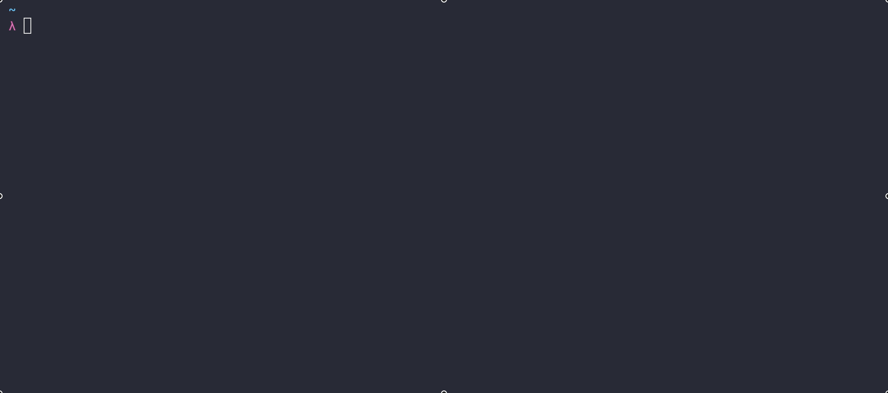

# snake

[](https://github.com/mike182uk/snake/actions/workflows/ci.yml)
[](https://www.npmjs.com/package/snake)

A simple JavaScript implementation of [Snake](https://en.wikipedia.org/wiki/Snake_(video_game_genre))



## Prerequisites

- Node.js >= 12

## Usage

```bash
npx run @mike182uk/snake
```

## Why?

Because why not 🤓

## Implementation Notes

### Goals

1. Create a simple interactive [Snake](https://en.wikipedia.org/wiki/Snake_(video_game_genre)) game that can be played in the console. The game should accept input from the keyboard and update in realtime
2. Keep the game logic as decoupled as possible from the rendering and input logic (so that other rendering / input interfaces can be used if desired)

### Game Rules

1. The snake can only be moved `up`, `down`, `left` or `right`
2. If the snake collides with a boundary the game is over
3. If the snake collides with itself the game is over
4. The size of the snake increases by 1 whenever food is consumed
5. The score is: the size of the snake - 1 (as the game starts with the snake already having a size of 1)

### Internals

Taking a peek at the source is probably best way to see how things tick (pun intended 😃), but here are some supplementary notes:

#### The game loop

The game runs on a loop. The loop is started when `Game.start` is called. The speed at which the loop iterates is dictated by the value passed to `Game.start` (in `ms`). On each iteration of the loop (a `tick`) the state of the game is computed and an event (`tick`) is emitted containing the game state (the `Game` instance is an event emitter). On each `tick` the snake moves 1 place in the direction set. This is repeated until an exit condition: 
   1. The snake collides with a boundary / itself
   2. The user executes an `exit` action

#### Input

Any input on `stdin` is analysed and if the the input matches an expected value an action is executed on the `Game` instance. There are only 2 types of actions that can be executed:
  1. Moving the snake
  2. Exiting the game

A move action is always executed on the next `tick` of the game loop - This is to prevent the user from moving the snake in an invalid direction (i.e moving `up` when the snake is currently moving `down`).

#### Rendering

[log-update](https://github.com/sindresorhus/log-update) is used to render a `frame` of the game to the console. This occurs on each iteration of the game loop (an event handler is bound to the `tick` event that is emitted by the `Game` instance). The event handler computes how the frame should be displayed and `log-update` handles the realtime updating of the console.

The event handler is passed a `Matrix` instance which represents the placement of the snake on a grid:

```
000000
0S0000
0S0000
0S0000
0000F0
000000
```

`0` = empty `S` = snake `F` = food

_The above is for illustrative purposes. The actual values used in the matrix will be different (and are configurable)._

The `score`, `status` (i.e `running`, `finished` etc.) and `size` of the matrix are also passed to the event handler so more context can be included in the rendered frame.

### Questions

#### Why is the matrix that is used by the renderer generated on each tick instead of being persisted for the life of the game?

While this seems like a more sane approach, it turned out to be a pain to keep the matrix up to date based on events happening in the game (i.e having to unset values in the matrix when the snake moved, having to relocate the food when it has been consumed etc.). Also, having to determine where things are placed in the game meant having to iterate over the rows in the matrix multiple times, which was inefficient. 

The alternative approach I took was persisting the coordinates for each part of the snake and the location of the food (on a matrix that would be generated in the future - we can calculate these coordinates before generating the matrix as we know the size of the matrix upfront), then generate a matrix on each tick of the game loop, compositing the snake and food on top of it. This greatly simplifies the logic and increases the efficiency although requires a different mental model when thinking about the game state.
